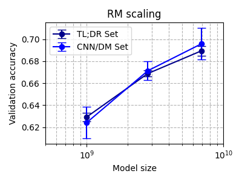
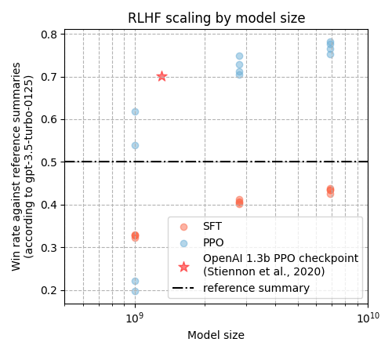

# summarize_from_feedback_details

The follow-up work of https://huggingface.co/blog/the_n_implementation_details_of_rlhf_with_ppo


Prerequisites:
* A slurm cluster of 8xH100 box (we are thinking of adding LORA)


## Get started

Install the dependencies

```
# with poetry (recommended)
poetry install
# or with pip
pip install -r requirements.txt
```

## Run inference

```
python visualize_tokens.py
```

[](https://asciinema.org/a/648179)


To run a hello world example, you can run the `hello_world.sh` script. For the full scaling behaviors experiment, you can run 

```
mkdir -p slurm/logs
sft_job_id=$(sbatch --parsable sbatches/sft.sbatch)
rm_job_id=$(sbatch --parsable --dependency=afterany:$sft_job_id sbatches/reward.sbatch)
ppo_job_id=$(sbatch --parsable --dependency=afterany:$rm_job_id sbatches/ppo_left_padding.sbatch)
```

The command above runs end-to-end RLHF experiments with 4 random seeds. We then run the following scripts to fetch experiments and generate plots

```
cd eval
python sft_rm_scale.py
python rlhf_scaling_plot.py
```

| Rouge Score (sft.py) | Reward Model (reward.py) | 
| --- | --- | 
|  |  |
| RLHF Policy (ppo_left_padding.py) | |
|  | |


### Dataset Information


We use our pre-built TL;DR datasets:
* SFT dataset: [vwxyzjn/summarize_from_feedback_tldr_3_filtered_oai_preprocessing_1706381144](https://huggingface.co/datasets/vwxyzjn/summarize_from_feedback_tldr_3_filtered_oai_preprocessing_1706381144)
* Preference dataset: [vwxyzjn/summarize_from_feedback_oai_preprocessing_1706381144](https://huggingface.co/datasets/vwxyzjn/summarize_from_feedback_oai_preprocessing_1706381144)

You can optionally build them yourself with

```bash
poetry run python summarize_from_feedback_details/tldr_dataset.py \
    --base_model=EleutherAI/pythia-1b-deduped \
    --tldr_params.max_sft_response_length=53 \
    --tldr_params.max_sft_query_response_length=562 \
    --tldr_params.max_rm_response_length=169 \
    --tldr_params.max_rm_query_response_length=638 \
    --cnndm_params.max_rm_response_length=155 \
    --cnndm_params.max_rm_query_response_length=2021 \
    --tldr_params.padding="pad_token" \
    --cnndm_params.padding="pad_token"
    # --push_to_hub # you can optionally push to hub
```

Note that these datasets use the same OpenAI processing as the original paper ([summarize-from-feedback/tasks.py#L98-L165](https://github.com/openai/summarize-from-feedback/blob/700967448d10004279f138666442bf1497d0e705/summarize_from_feedback/tasks.py#L98-L165)); it does things like

* make sure query is only 512 tokens (pad if shorter, and ''smartly truncate'' if longer, e.g., like it will truncate at before the last `\n` instead of a hard truncation.)
* make sure response tokens is limited
